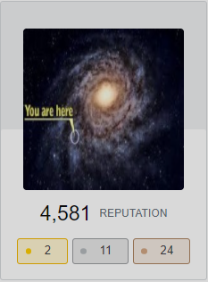

### Hi there 👋

- 🔭 I’m currently working on building an API-Gateway, and setting up a pipeline to contribute to [go-sql-driver/mysql](https://github.com/go-sql-driver/mysql)
- 🌱 I’m currently learning(advancing on) Go, Python, Docker, VueJS
- 👯 I’m looking for collaboration on enhancing some of my existing projects
- ⚡ Fun fact: My name is pronouced just like [ASCII](https://en.wikipedia.org/wiki/ASCII)
- 📧 `print("".join(chr(i) for i in [97, 122, 107, 121, 109, 117, 98, 97, 114, 97, 99, 107, 49, 50, 51, 64, 103, 109, 97, 105, 108, 46, 99, 111, 109]))`

If I am not here, I am on StackOverflow, and not there I am probably busy...

<!--
**AzyCrw4282/azycrw4282** is a ✨ _special_ ✨ repository because its `README.md` (this file) appears on your GitHub profile.

Here are some ideas to get you started:

- 🔭 I’m currently working on ...
- 🌱 I’m currently learning ...
- 👯 I’m looking to collaborate on ...
- 🤔 I’m looking for help with ...
- 💬 Ask me about ...
- 📫 How to reach me: ...
- 😄 Pronouns: ...
- ⚡ Fun fact: ...

<a href="https://stackoverflow.com/users/6505847/azycrw4282" </a>
-->

